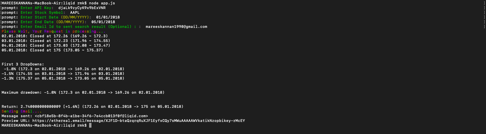
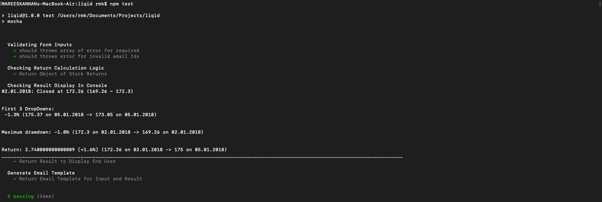
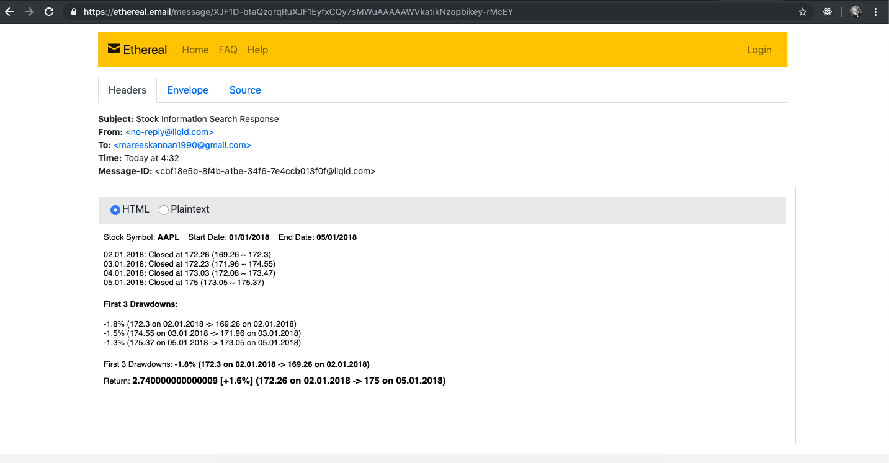

# stock-information-app
A Simple Command Line Application To Access Stock Information &amp; Offers the option to share the information on another channel like email or Slack

Goto Root Folder do **_npm install_**

Run **_node app.js_** to access stock information

Run **_npm test.js_** to run test cases

Check **screenshots** folder for sample outputs.

